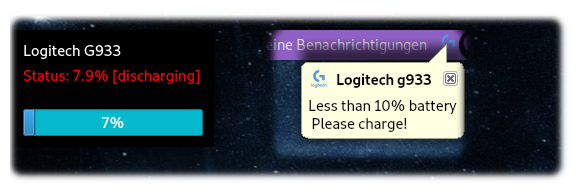

# GUI for g933 Utils
Basicly shows your Battery Status & Capacity and you have the TrayIcon in the TopBar. Same as with the original Logitech Software, except the Features like setting stuff and so on (I'll try to implement it).  Even without bigger functionalities for Linux Users a step forward! :> (small Showcase below)

What it detects:
1. It detects if your Headset is turned off / turns off / turns on / turned on
2. Low Battery / Half or Full Battery Capacity
3. Charging / Discharging

The Window remains in the Foreground and you can hide it by minimizing it. When the TrayIcon is double clicked, the App hides or shows itself. By a right click a Menu opens and you can click "exit" to close the Application (completly).

You can also add it to the System Start, but due to Security reasons you should set the write and read permissions correctly and your user must be in the "logitech" group (as in g933-utils main repository stated)

## Requirements (Linux only)
needs Qt5, python and g933-utils

## Installation
#### Python Installing
> apt-get install python

#### Install Qt5 
https://pypi.org/project/PyQt5/
> pip install PyQt5

#### g933 Utils
you can just pull it out of the repo here  (pre compiled for 64bit) or you just grab it from the fork repo (inside g933-utils folder) and build it yourself.

## Usage
Just go into the folder where you have cloned it. Then just run the main.py. If you want to set it in the Starters, when the User logs on, you need to add it to a location in /usr/bin/<folder> and link it in the Startup Properties. 
  
#### Set execution rights
chmod +x main.py

#### Start it
./main.py

## Security Notice
Keep in mind, if you don't assign the right Permissions to your Files, a bad guy could abuse it with your own user Account.
I prefer to set them as root, and only executeable for others. This can also be abused, if the Bad guy is root (but then you might have fully different problems)

I just warned you and I don't take warranty for this program, even not partially. 
You install it on YOUR OWN RISK! 
